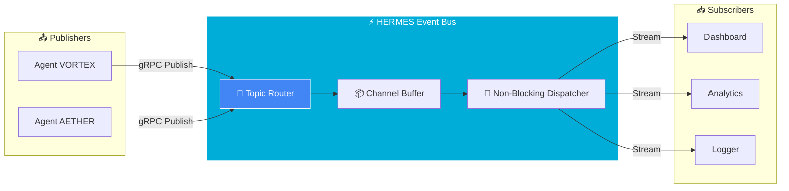

<div align="center">

```
  ██╗  ██╗███████╗██████╗ ███╗   ███╗███████╗███████╗
  ██║  ██║██╔════╝██╔══██╗████╗ ████║██╔════╝██╔════╝
  ███████║█████╗  ██████╔╝██╔████╔██║█████╗  ███████╗
  ██╔══██║██╔══╝  ██╔══██╗██║╚██╔╝██║██╔══╝  ╚════██║
  ██║  ██║███████╗██║  ██║██║ ╚═╝ ██║███████╗███████║
  ╚═╝  ╚═╝╚══════╝╚═╝  ╚═╝╚═╝     ╚═╝╚══════╝╚══════╝
```

### ⚡ System 08/300: High-Performance Event Bus

[](https://golang.org)
[](https://grpc.io)
[](https://protobuf.dev)
[](LICENSE)

**Decentralized Pub/Sub for the Titan Protocol**

---

[Quick Start](#-quick-start) • [Architecture](#-architecture) • [API](#-api)

</div>

---

## 🚀 Quick Start

```bash
# 1. Install Dependencies & Generate Proto
make proto
make deps

# 2. Run Server (Terminal 1)
make run-server

# 3. Subscribe (Terminal 2)
make run-sub

# 4. Publish (Terminal 3)
make run-pub
```

---

## 🏗️ Architecture



---

## 📜 API

### Protocol Definition (`proto/service.proto`)

```protobuf
service EventBus {
    rpc Publish(Event) returns (Ack);
    rpc Subscribe(Subscription) returns (stream Event);
}
```

### Messages

| Message        | Fields                                  |
| -------------- | --------------------------------------- |
| `Event`        | `topic`, `payload (bytes)`, `timestamp` |
| `Ack`          | `success`, `message`                    |
| `Subscription` | `topic`                                 |

---

## 📁 Project Structure

```
.
├── cmd/
│   ├── server/main.go   # Event Bus Server
│   └── client/main.go   # CLI Client (Pub/Sub)
├── proto/
│   └── service.proto    # gRPC Service Definition
├── pb/                  # Generated Go code (after `make proto`)
├── Makefile
└── README.md
```

---

## 🔧 CLI Usage

```bash
# Subscribe to a topic
./bin/hermes-client -mode=sub -topic=agents

# Publish to a topic
./bin/hermes-client -mode=pub -topic=agents
```

---

## 🔗 Titan Protocol Initiative

| System     | Name       | Technology     |
| ---------- | ---------- | -------------- |
| 06/300     | AETHER     | Python + Voice |
| 07/300     | HELIOS     | Solana + Rust  |
| **08/300** | **HERMES** | **Go + gRPC**  |

---

<div align="center">

**Built with ⚡ Go + 🔗 gRPC by [Davi Bonetto](https://github.com/DaviBonetto)**

_Part of the Titan Protocol Initiative_

</div>
